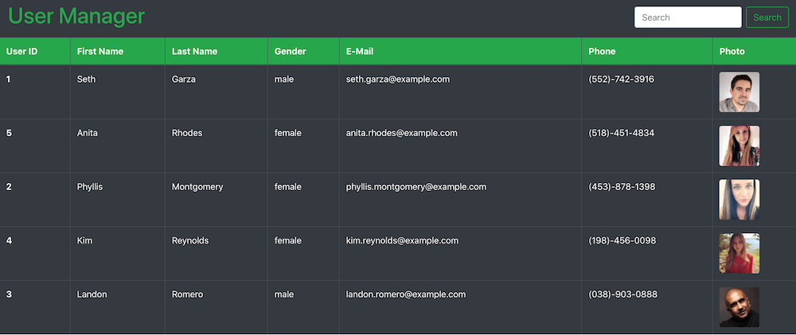

# React Employee Directory
  
  ## Description
  An employee directory created with react. With columns that sort from ascending to descending.
  ## Table of Contents
  1. [Installation](#installation)
  2. [Usage](#usage)
  3. [License](#license)
  4. [Contributing](#contributing)
  5. [Tests](#tests)
  6. [Questions](#questions)
  ## Installation
  Please download the files in the repository and then run NPM I to install the required components.
  You can also navigate to the deployed version on heroku here. 

  [Link to App]()
  ## License
  The license type chosen for this app is:

  **None**
  
  For more details on this license type please use the following link: 

  https://opensource.org/osd-annotated
  ## Contributing
  
  ## Tests
  

  ## Questions
  If you have any questions please feel free to contact me via the links below:
  * GitHub: [DanielGerrald](https://github.com/DanielGerrald)
  * E-Mail: daniel.gerrald@icloud.com
